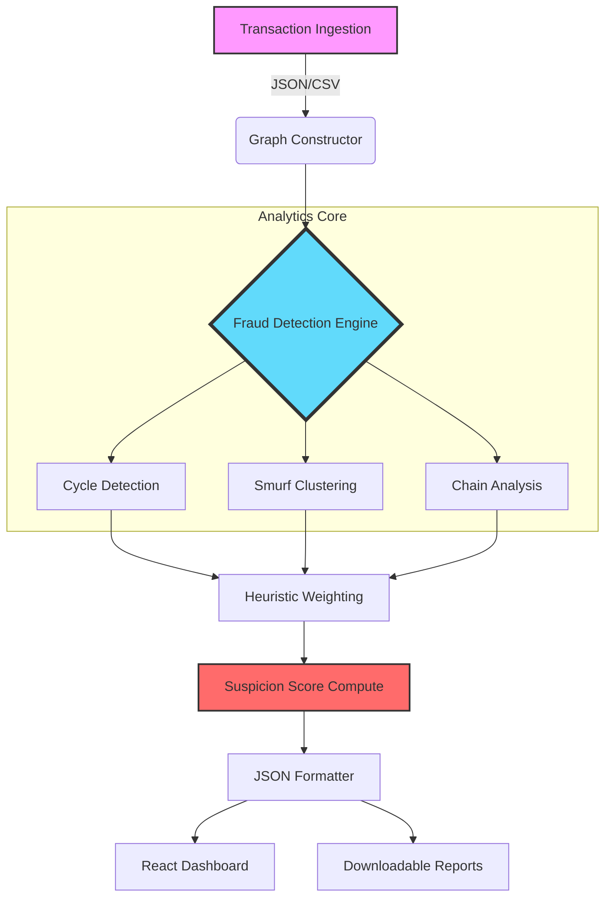
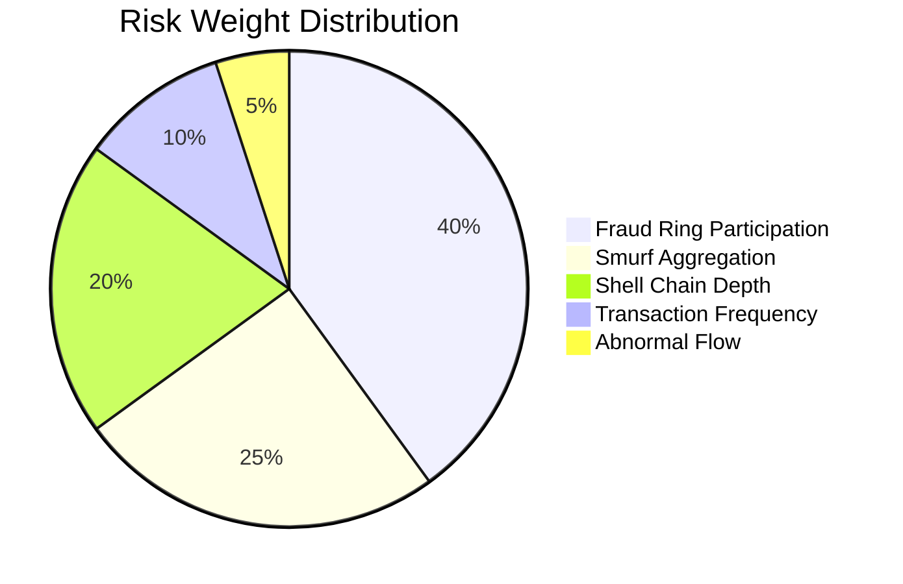

<div align="center">

# RIFT EYE
### Advanced Financial Intelligence & Fraud Graph Analytics

[](https://nodejs.org)
[](https://reactjs.org)
[](https://en.wikipedia.org/wiki/Graph_theory)
[](https://opensource.org/licenses/MIT)

---

**RIFT EYE** is a high-performance financial fraud detection engine architected to illuminate illicit money movement patterns. By treating transaction data as a complex directed graph, the system identifies fraud rings, money laundering cycles, and suspicious account clusters with surgical precision.

[Live Dashboard](https://rift-hackathon-puce.vercel.app) • [API Documentation](#api-reference) • [Report Bug](https://github.com/mohitmudgil/p4/issues)

</div>

## Core Detection Capabilities

The engine is engineered to detect sophisticated financial crimes that traditional rule-based systems often miss:

*   **Fraud Rings**: Detection of circular money movement (Cycles).
*   **Smurfing Patterns**: Identification of bipartite-style fund aggregation from multiple low-value sources.
*   **Shell Chains**: Uncovering deep-layering transfers through intermediary accounts.
*   **Dynamic Suspicion Scoring**: Real-time risk assessment based on behavioral topology.

---

## System Architecture

The following diagram illustrates the high-level data flow and processing pipeline of RIFT EYE.



---

## Algorithmic Methodology

RIFT EYE leverages graph-theoretic algorithms optimized for sparse transaction networks.

### 1. Fraud Ring Detection (Johnson's Modified)
Identifies circular transfers that indicate money laundering or credit circularity.
- **Complexity**: $O((V + E)(C + 1))$
- **Optimization**: Strongly Connected Components (SCC) filtering prior to cycle enumeration.

### 2. Smurfing Detection (Bipartite Clustering)
Detects "many-to-one" transfer patterns typical of money mules.
- **Approach**: In-degree concentration analysis and variance-based thresholding.
- **Complexity**: $O(V + E)$

### 3. Shell Layering (Depth Traversal)
Identifies elongated paths of fund movement intended to obscure the source of wealth.
- **Approach**: Pruned Depth-First Search with path-length constraints.

---

## Suspicion Score Methodology

Each account is assigned a risk coefficient (0-100) based on weighted topological features.



| Factor | Weight | Description |
| :--- | :---: | :--- |
| **Fraud Ring** | +40 | Participation in a detected circular graph topology |
| **Smurf Aggregation** | +25 | High in-degree with low-value transaction variance |
| **Shell Chain** | +20 | Part of a linear chain exceeding depth thresholds |
| **Frequency** | +10 | Transaction velocity exceeding baseline stdev |
| **Flow Pattern** | +5 | Deviations from expected temporal seasonality |

---

## Tech Stack

### Infrastructure & Language
- **Runtime**: Node.js (V8 Engine)
- **Framework**: Express.js
- **Frontend**: React.js 18+

### Data Architecture
- **Structure**: Optimized Adjacency Lists
- **Visualization**: D3.js & React-Force-Graph
- **Styling**: TailwindCSS (Modern Glassmorphism Design)

---

## Installation & Deployment

Prepare your environment to run RIFT EYE locally.

### Prerequisites
- Node.js >= 16.x
- npm >= 8.x

### Steps

1. **Clone and Install**
   ```bash
   git clone https://github.com/mohitmudgil/p4.git
   cd p4
   npm install
   ```

2. **Initialize Server**
   ```bash
   npm start
   ```
   *The backend will be available at `http://localhost:5050`*

3. **Initialize Frontend**
   ```bash
   cd client
   npm install
   npm start
   ```
   *The dashboard will be available at `http://localhost:3000`*

---

## Performance Characteristics

- **Linear Scalability**: Processing time scales near-linearly ($O(N)$) for typical sparse financial graphs.
- **Memory Optimization**: Uses bitset-based visited tracking and adjacency list pruning to minimize heap usage.
- **Concurrency**: Non-blocking asynchronous I/O for handling simultaneous analytics requests.

---

## Development Team

<div align="left">

- **Yash Saini** – System Design & Architecture
- **Mohit Mudgil** – Core Engine & Full Stack Development
- **Sofi** – Data Analytics & Full Stack
- **Tanika** – UI Engineering & UX Strategy

</div>

---

<div align="center">

Built for the Financial Intelligence Hackathon | RIFT EYE © 2026

</div>
